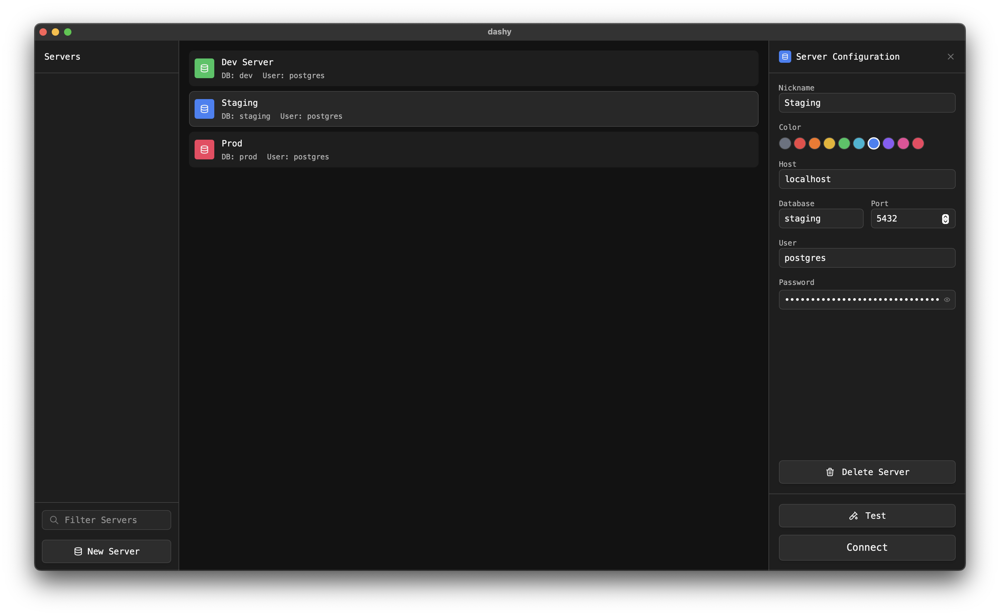
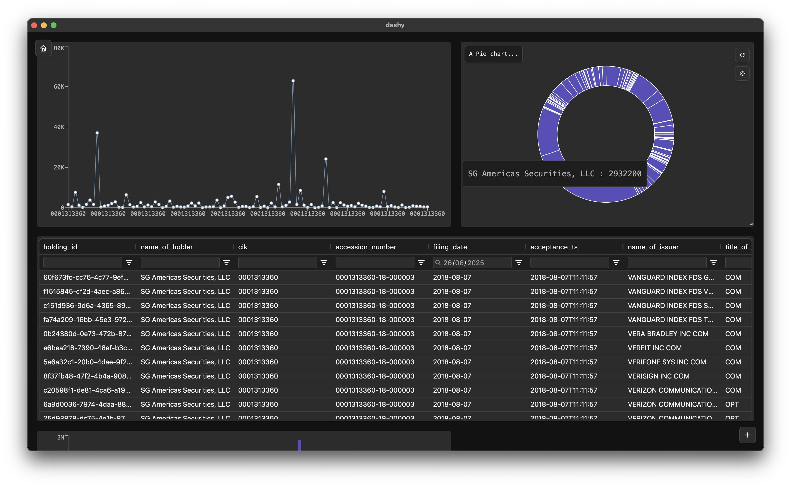

# Dashy

Dashy is a simple, customizable dashboard app for your postgres databases. It allows you to build data visualisation dashboards quickly and easily using SQL.

# Manage Servers:

# Build a Dashboard:

